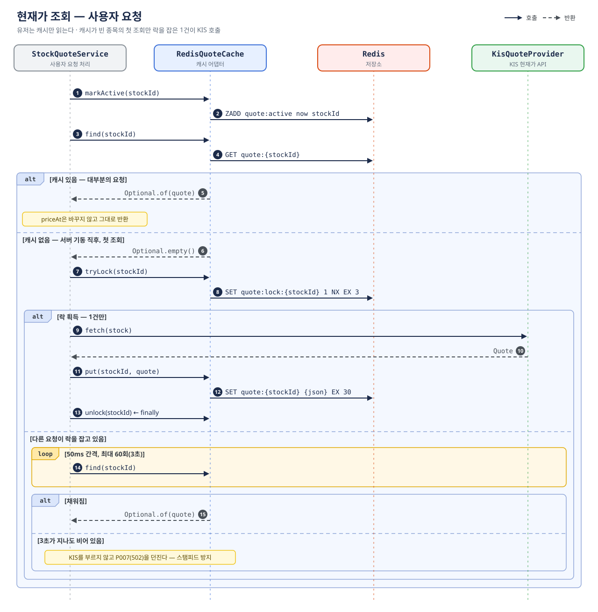
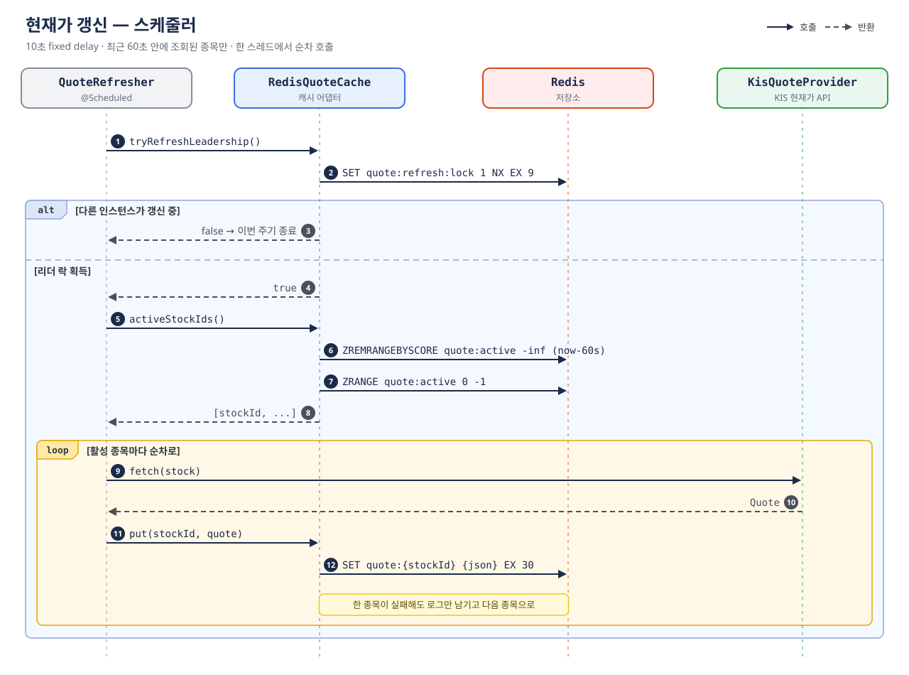
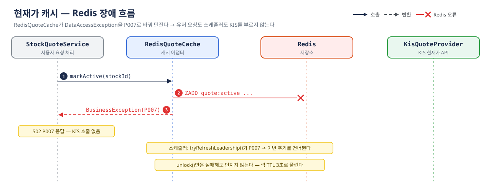

# 현재가 캐시 흐름

서버가 최근 조회된 종목의 시세를 주기적으로 KIS에서 받아 Redis에 채우고, 사용자 요청은 캐시를 읽는다(refresh-ahead).
규칙의 기준은 `SPEC-stock-quote.md`의 캐시 절이다.

| 키 | 용도 | TTL |
| --- | --- | --- |
| `quote:{stockId}` | Quote JSON | 30초 (`ploutos.quote.cache-ttl-seconds`) |
| `quote:lock:{stockId}` | 캐시 미스용 single-flight 락 | 3초 |
| `quote:active` | 최근 조회 종목 ZSET (score = 조회 시각) | 없음, 60초 창 밖은 갱신 때 지움 |
| `quote:refresh:lock` | 갱신 리더 락 | 9초 |

## 사용자 요청

대부분의 요청은 캐시에서 끝난다. KIS를 호출하는 요청은 캐시가 빈 종목의 첫 조회에서 락을 잡은 1건뿐이다.

## 스케줄러 갱신

`QuoteRefresher`가 10초 fixed delay로 활성 종목을 순차 갱신한다. 값 TTL(30초)이 갱신 주기의 3배라 만료되기 전에 덮어쓴다.

## Redis 장애

KIS를 직접 부르지 않고 `P007`로 응답한다. 장애 중 요청이 모두 KIS로 몰리는 것을 막기 위해서다.

## KIS 실패

`provider.fetch()`가 `MARKET_DATA_UNAVAILABLE`을 던지면 만료된 캐시로 대신하지 않고 그대로 전파한다. 락은 `finally`에서 해제한다.
